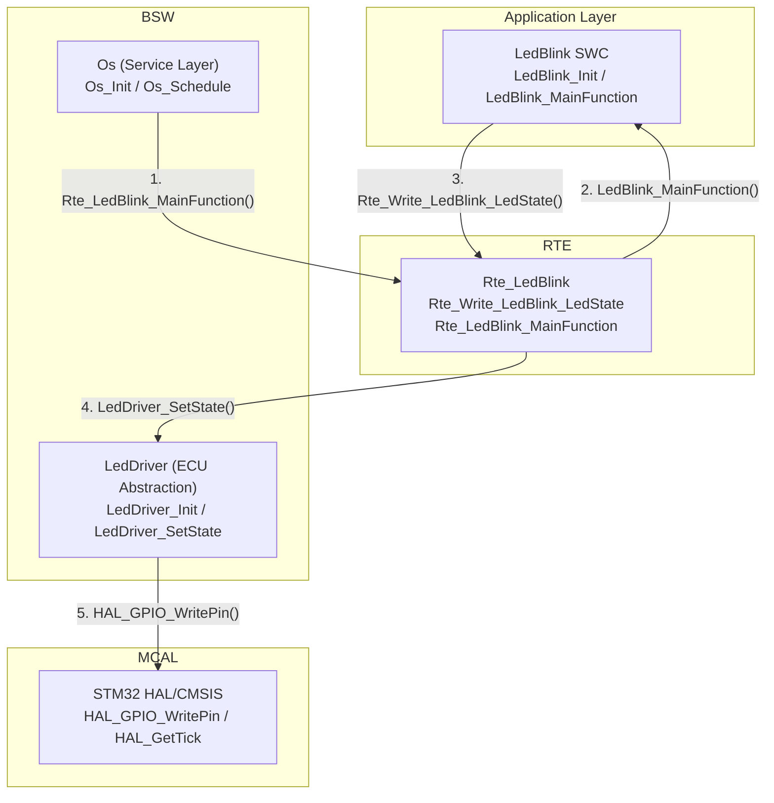
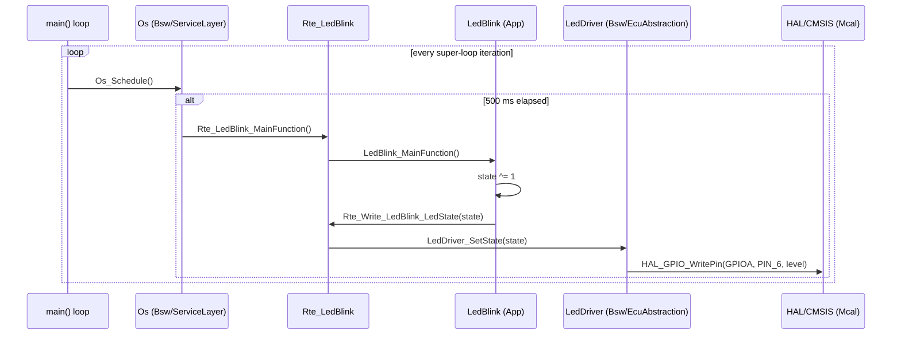

# LED_BLINK Component Specification

| | |
|---|---|
| Document Title | LED_BLINK Component Specification |
| Document Type  | Component Specification (SWS-style, AUTOSAR-inspired) |
| Component      | LED_BLINK |
| Layers covered | Application, RTE, BSW (Service Layer, ECU Abstraction Layer) |
| Project        | STM32F4 |
| Status         | Draft |

---

## 1. Introduction and Functional Overview

The **LED_BLINK** component implements a periodic toggling of a single digital
output (an LED) at a fixed rate. It is the reference/example component used to
validate the AUTOSAR-inspired layered architecture of the `STM32F4` project.

Functionally, LED_BLINK:

- Maintains one Boolean logical state (`ON` / `OFF`).
- Flips that state every time it is activated.
- Forwards the new state down to the hardware through the RTE and BSW layers,
  without any knowledge of which microcontroller pin is actually driven.

LED_BLINK is activated periodically, every **500 ms**, by the `Os` scheduler
service (see [`Bsw/ServiceLayer/Os`](../../Bsw/ServiceLayer/Os)).

## 2. Acronyms and Abbreviations

| Acronym | Meaning |
|---|---|
| SWC  | Software Component (Application Layer) |
| RTE  | Runtime Environment |
| BSW  | Basic Software |
| MCAL | Microcontroller Abstraction Layer |
| S/R  | Sender/Receiver (communication pattern) |
| GPIO | General Purpose Input/Output |

## 3. Architecture / Layer Mapping

LED_BLINK is not a single file — it is a **vertical slice** spanning every
layer of the architecture. Each layer only knows about the layer directly
below it:

| Layer | Module | Path | Responsibility |
|---|---|---|---|
| Application | `LedBlink` (SWC) | `App/LedBlink/` | Owns the logical ON/OFF state and the toggle decision. No hardware knowledge. |
| RTE | `Rte_LedBlink` | `Rte/` | Glue code: routes the SWC's port write down to BSW, and dispatches the OS task tick up into the SWC runnable. |
| BSW – Service Layer | `Os` | `Bsw/ServiceLayer/Os/` | Cooperative scheduler; decides *when* (every 500 ms) LED_BLINK runs. Generic — not aware LED_BLINK exists, only calls the RTE. |
| BSW – ECU Abstraction | `LedDriver` | `Bsw/EcuAbstraction/LedDriver/` | Knows the ECU-specific wiring (LED is on pin PA6). Translates a logical ON/OFF into a GPIO write. |
| MCAL | ST HAL/CMSIS | `Drivers/STM32F4xx_HAL_Driver/`, `Drivers/CMSIS/` | Microcontroller register access (`HAL_GPIO_WritePin`, clocks, `HAL_GetTick`). Vendor-supplied, unmodified. |



## 4. Dependencies to Other Modules

| Module | Dependency |
|---|---|
| `Bsw/ServiceLayer/Os` | Calls `Rte_LedBlink_MainFunction()` every 500 ms. |
| `Bsw/EcuAbstraction/LedDriver` | Receives `LedDriver_SetState()` calls from the RTE. |
| `Drivers/STM32F4xx_HAL_Driver` | Used by `LedDriver` (`HAL_GPIO_WritePin`) and by `Os` (`HAL_GetTick`). |
| `Core/Src/main.c` | Orchestrates startup order: `LedDriver_Init()` → `LedBlink_Init()` → `Os_Init()`, then calls `Os_Schedule()` in the super-loop. |

## 5. Requirements

| ID | Requirement |
|---|---|
| `[SWS_LedBlink_00001]` | The LedBlink SWC shall expose an `Init` lifecycle function that sets the initial logical LED state to `OFF`. |
| `[SWS_LedBlink_00002]` | The LedBlink SWC shall expose a `MainFunction` runnable that inverts its internal logical LED state each time it is invoked. |
| `[SWS_LedBlink_00003]` | The LedBlink SWC shall not access MCAL/GPIO registers directly; all hardware access shall go through the RTE. |
| `[SWS_LedBlink_00004]` | The RTE shall provide a Sender/Receiver port `Rte_Write_LedBlink_LedState` that forwards the SWC's logical state to the `LedDriver` BSW module. |
| `[SWS_LedBlink_00005]` | The RTE shall provide a task-dispatch entry point `Rte_LedBlink_MainFunction` so that the `Os` service never calls into the Application Layer directly. |
| `[SWS_LedBlink_00006]` | The `Os` service shall invoke `Rte_LedBlink_MainFunction` at a fixed period of 500 ms, measured via `HAL_GetTick`. |
| `[SWS_LedBlink_00007]` | The `LedDriver` module shall map the logical states `LEDDRIVER_ON`/`LEDDRIVER_OFF` to the physical pin `GPIOA/GPIO_PIN_6` and shall be the only module aware of this mapping. |

## 6. Data Types

### 6.1 `LedDriver_StateType`

Defined in [`Bsw/EcuAbstraction/LedDriver/Inc/LedDriver.h`](../../Bsw/EcuAbstraction/LedDriver/Inc/LedDriver.h).

```c
typedef enum
{
    LEDDRIVER_OFF = 0,
    LEDDRIVER_ON  = 1
} LedDriver_StateType;
```

| Value | Meaning |
|---|---|
| `LEDDRIVER_OFF` | LED physically off (pin driven low). |
| `LEDDRIVER_ON`  | LED physically on (pin driven high). |

The Application and RTE layers exchange the logical state as a plain
`uint8_t` (`0`/`1`) at the `Rte_Write_LedBlink_LedState` port; the mapping to
`LedDriver_StateType` happens only inside the RTE, right before calling the
BSW.

## 7. API / Function Specification

Each function below follows the AUTOSAR SWS convention: **Syntax**,
**Parameters**, **Return value**, **Description**, **Preconditions**,
**Called by**, **Calls**.

### 7.1 `LedBlink_Init` — Application Layer

| | |
|---|---|
| File | `App/LedBlink/Src/LedBlink.c` |
| Syntax | `void LedBlink_Init(void);` |
| Parameters (in) | none |
| Parameters (out) | none |
| Return value | none |
| Description | SWC lifecycle function. Resets the internal logical LED state to `0` (OFF) and immediately writes it down through the RTE, so the LED starts in a known state. |
| Preconditions | Must be called exactly once, after `LedDriver_Init()` and before the scheduler (`Os_Schedule`) starts running. |
| Called by | `main()` (`Core/Src/main.c`, `USER CODE BEGIN 2`) |
| Calls | `Rte_Write_LedBlink_LedState()` |

### 7.2 `LedBlink_MainFunction` — Application Layer

| | |
|---|---|
| File | `App/LedBlink/Src/LedBlink.c` |
| Syntax | `void LedBlink_MainFunction(void);` |
| Parameters (in) | none |
| Parameters (out) | none |
| Return value | none |
| Description | SWC runnable. Inverts the internal logical LED state (`state ^= 1`) and writes the new value down through the RTE. This is the only place the "blink" decision is made. |
| Preconditions | `LedBlink_Init()` must have run first. |
| Called by | `Rte_LedBlink_MainFunction()` |
| Calls | `Rte_Write_LedBlink_LedState()` |

### 7.3 `Rte_Write_LedBlink_LedState` — RTE

| | |
|---|---|
| File | `Rte/Src/Rte_LedBlink.c` |
| Syntax | `void Rte_Write_LedBlink_LedState(uint8_t state);` |
| Parameters (in) | `state` — logical LED state, `0` = OFF, non-zero = ON |
| Parameters (out) | none |
| Return value | none |
| Description | Sender/Receiver port implementation. Translates the SWC's plain `uint8_t` state into the BSW's `LedDriver_StateType` and forwards it to `LedDriver_SetState()`. This is the single point where the Application Layer's abstract state is converted into a BSW-level type. |
| Preconditions | none |
| Called by | `LedBlink_Init()`, `LedBlink_MainFunction()` |
| Calls | `LedDriver_SetState()` |

### 7.4 `Rte_LedBlink_MainFunction` — RTE

| | |
|---|---|
| File | `Rte/Src/Rte_LedBlink.c` |
| Syntax | `void Rte_LedBlink_MainFunction(void);` |
| Parameters (in) | none |
| Parameters (out) | none |
| Return value | none |
| Description | Task-body / runnable-dispatch function. Represents the RTE-generated glue that an OS task would normally call in a full AUTOSAR stack. Its only job is to invoke the SWC's runnable, keeping the BSW (`Os`) from ever calling into the Application Layer directly. |
| Preconditions | none |
| Called by | `Os_Schedule()` |
| Calls | `LedBlink_MainFunction()` |

### 7.5 `LedDriver_Init` — BSW / ECU Abstraction Layer

| | |
|---|---|
| File | `Bsw/EcuAbstraction/LedDriver/Src/LedDriver.c` |
| Syntax | `void LedDriver_Init(void);` |
| Parameters (in) | none |
| Parameters (out) | none |
| Return value | none |
| Description | Module lifecycle function, present for symmetry with the AUTOSAR BSW module init pattern. Currently a no-op: GPIO clock enabling and pin-mode configuration are already performed by the CubeMX-generated `MX_GPIO_Init()` (MCAL) during MCU initialization. |
| Preconditions | `MX_GPIO_Init()` must have already configured PA6 as push-pull output. |
| Called by | `main()` (`Core/Src/main.c`, `USER CODE BEGIN 2`) |
| Calls | none |

### 7.6 `LedDriver_SetState` — BSW / ECU Abstraction Layer

| | |
|---|---|
| File | `Bsw/EcuAbstraction/LedDriver/Src/LedDriver.c` |
| Syntax | `void LedDriver_SetState(LedDriver_StateType state);` |
| Parameters (in) | `state` — `LEDDRIVER_ON` or `LEDDRIVER_OFF` |
| Parameters (out) | none |
| Return value | none |
| Description | Applies the requested logical state to the physical pin wired to the LED (`GPIOA`, `GPIO_PIN_6`). This is the **only** function in the whole component that knows the port/pin mapping. |
| Preconditions | `LedDriver_Init()` must have run first. |
| Called by | `Rte_Write_LedBlink_LedState()` |
| Calls | `HAL_GPIO_WritePin()` (MCAL) |

### 7.7 `Os_Init` — BSW / Service Layer

| | |
|---|---|
| File | `Bsw/ServiceLayer/Os/Src/Os.c` |
| Syntax | `void Os_Init(void);` |
| Parameters (in) | none |
| Parameters (out) | none |
| Return value | none |
| Description | Initializes the scheduler's internal bookkeeping by capturing the current SysTick value (`HAL_GetTick()`) as the reference point for the first period computation. |
| Preconditions | `HAL_Init()` / SysTick must already be running. |
| Called by | `main()` (`Core/Src/main.c`, `USER CODE BEGIN 2`) |
| Calls | `HAL_GetTick()` (MCAL) |

### 7.8 `Os_Schedule` — BSW / Service Layer

| | |
|---|---|
| File | `Bsw/ServiceLayer/Os/Src/Os.c` |
| Syntax | `void Os_Schedule(void);` |
| Parameters (in) | none |
| Parameters (out) | none |
| Return value | none |
| Description | Cooperative scheduler tick. Must be called repeatedly from the main super-loop (non-blocking). On each call it checks whether `OS_LEDBLINK_PERIOD_MS` (500 ms) has elapsed since the LED_BLINK task last ran; if so, it updates the reference tick and dispatches `Rte_LedBlink_MainFunction()`. |
| Preconditions | `Os_Init()` must have run first. |
| Called by | `main()` (`Core/Src/main.c`, main super-loop, `USER CODE BEGIN 3`) |
| Calls | `HAL_GetTick()` (MCAL), `Rte_LedBlink_MainFunction()` (RTE) |

## 8. Sequence Diagram — One Blink Cycle



## 9. Configuration

| Parameter | Value | Defined in |
|---|---|---|
| Blink period | `500` ms | `OS_LEDBLINK_PERIOD_MS`, `Bsw/ServiceLayer/Os/Src/Os.c` |
| LED port/pin | `GPIOA`, `GPIO_PIN_6` | `LEDDRIVER_PORT`/`LEDDRIVER_PIN`, `Bsw/EcuAbstraction/LedDriver/Src/LedDriver.c` |
| Initial state | OFF | `LedBlink_Init()`, `App/LedBlink/Src/LedBlink.c` |

## 10. Traceability Matrix

| Requirement | Implemented by |
|---|---|
| `SWS_LedBlink_00001` | `LedBlink_Init` |
| `SWS_LedBlink_00002` | `LedBlink_MainFunction` |
| `SWS_LedBlink_00003` | `App/LedBlink/*` (no `stm32f4xx_hal.h` include) |
| `SWS_LedBlink_00004` | `Rte_Write_LedBlink_LedState` |
| `SWS_LedBlink_00005` | `Rte_LedBlink_MainFunction` |
| `SWS_LedBlink_00006` | `Os_Schedule`, `OS_LEDBLINK_PERIOD_MS` |
| `SWS_LedBlink_00007` | `LedDriver_SetState`, `LEDDRIVER_PORT`/`LEDDRIVER_PIN` |
